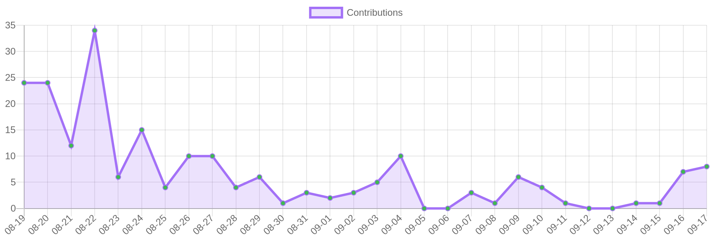
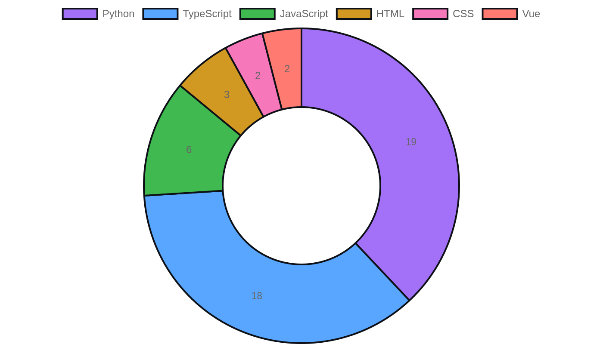

<!-- README.md — DzCodeProgrammer (Dashboard style) -->

  

# 👋 Hi — I'm **DzCodeProgrammer**

Curious coder from Indonesia 🇮🇩 — I blend art & logic to build meaningful small products. <em>I code to express, not to impress.</em>

  
  
  
  

---

<!-- dashboard cards -->
<table width="100%">
  <tr>
    <td width="33%" valign="top">
      ### 📊 Summary
      <table>
        <tr><td></td></tr>
      </table>
      *Total repos, stars, recent commits — generated daily.*
    </td>

    <td width="33%" valign="top">
      ### 🔁 Contribution (30 days)
      
      *Grafik ini menunjukkan commit/kontribusi (aproks.) pada 30 hari terakhir.*
    </td>

    <td width="33%" valign="top">
      ### 🧰 Languages (Top)
      
      *Distribusi bahasa pemrograman berdasarkan repo publik.*
    </td>
  </tr>
</table>

---

## About / Tentang Saya
Seorang pembelajar dan pembuat kecil (maker) yang suka bereksperimen: UI/UX sederhana, animasi micro, dan proyek web. Tujuan: membangun produk bermakna sambil terus belajar.

- 💻 Fokus: HTML, CSS, JavaScript, PHP (belajar full-stack)  
- 🔧 Tools: Git, VSCode, npm, Composer  
- 🌱 Motto: *Build small. Fail fast. Learn always.*

---

## Projects (pin & highlight)

Interactive Anime Portfolio

Landing page dengan micro-animation, responsive layout, theme-switcher.  
`https://github.com/DzCodeProgrammer/interactive-anime-portfolio`

Guess the Word — Mini Game

Browser game sederhana (Vanilla JS + localStorage).  
`https://github.com/DzCodeProgrammer/guess-the-word`

---

## Notes
- Semua gambar chart berada di folder `assets/` dan dihasilkan oleh GitHub Action `generate-charts`.  
- Jika ingin mengubah frekuensi update: edit cron di workflow (`.github/workflows/generate-charts.yml`).  
- Jika widget tidak muncul setelah push: jalankan workflow manual di tab Actions.

---

Made with ❤️ — **DzCodeProgrammer**

