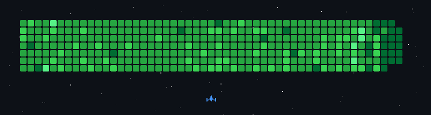

<p align="center">
  
</p>

<p align="center">
  
</p>

<p align="center">
  <a href="https://github.com/DzCodeProgrammer"></a>
  <a href="https://github.com/sponsors/DzCodeProgrammer"></a>
  
  
  
</p>

<p align="center">
  
  
  
  
</p>

---

<p align="center">
  <a href="https://github.com/DzCodeProgrammer">
    <picture>
      <source media="(prefers-color-scheme: dark)" srcset="./dark.svg"/>
      
    </picture>
  </a>
</p>

---

<h2 align="center" id="github-achievements">🏆 GitHub Achievements</h2>

<p align="center">
  
  
  
  
  
  
  
  
</p>

| Achievement | Deskripsi | Status |
| --- | --- | --- |
| 🎯 **YOLO** | Merge pull request tanpa code review | ✅ Unlocked |
| 🦈 **Pull Shark** | Buka PR yang berhasil di-merge | ✅ Unlocked |
| 🧠 **Galaxy Brain** | Jawaban diskusi diterima sebagai solusi | ✅ Unlocked |
| 🤝 **Pair Extraordinaire** | Co-author commit di PR yang di-merge | ✅ Unlocked |
| ⚡ **Quickdraw** | Tutup issue/PR dalam 5 menit setelah dibuka | ✅ Unlocked |
| ⭐ **Starstruck** | Buat repository dengan 16+ stars | ✅ Unlocked |
| 💜 **Heart On Your Sleeve** | Bereaksi dengan emoji di GitHub | ✅ Unlocked |
| 💖 **Public Sponsor** | Mensponsori open source via GitHub Sponsors | ✅ Unlocked |
| 🌐 **Open Sourcerer** | PR di-merge di banyak repository publik | 🔜 Target berikutnya |

<details>
<summary><b>🏅 Tier Progress — Pull Shark, Starstruck, Galaxy Brain & Pair Extraordinaire</b></summary>
<br>

| Achievement | Default | Bronze 🥉 | Silver 🥈 | Gold 🥇 |
| --- | :---: | :---: | :---: | :---: |
| **Pull Shark** | 2 merged PRs | 16 | 128 | 1024 |
| **Starstruck** | 16 stars | 128 | 512 | 4096 |
| **Galaxy Brain** | 2 answers | 8 | 16 | 32 |
| **Pair Extraordinaire** | 1 co-author | 10 | 24 | 48 |

<p align="center">
  
  
  
  
  
  
</p>

</details>

<p align="center"><sub>More achievements coming soon as DzCodeProgrammer grows stronger ⚡</sub></p>

---

## 📑 Table of Contents

- [GitHub Achievements](#github-achievements)
- [About Me](#about-me)
- [Now](#now)
- [Roadmap 2026](#roadmap-2026)
- [Philosophy & Approach](#philosophy)
- [Skills & Personality](#skills)
- [Communication](#communication)
- [Soft Skills](#soft-skills)
- [Core Stack](#core-stack)
- [Teknologi yang Saya Pakai](#teknologi-pakai)
- [Toolkit Catalog](#technologies)
- [Featured Projects](#featured-projects)
- [Let's Collaborate](#collaborate)
- [Services](#services)
- [Developer Life](#developer-life)
- [Daily Dev Flow](#daily-dev-flow)
- [Fun Facts](#fun-facts)
- [Hobbies](#hobbies)
- [Favorite Stack Combos](#favorite-combos)
- [Learning Resources](#learning-resources)
- [Goals & Mindset](#goals-mindset)
- [Project Ideas Backlog](#project-ideas)
- [How I Build](#how-i-build)
- [What Good Looks Like](#definition-of-done)
- [FAQ](#faq)
- [Guestbook](#guestbook)
- [Quotes I Live By](#quotes)
- [Currently Listening](#currently-listening)
- [Workspace Setup](#workspace-setup)
- [Debugging Playbook](#debugging-playbook)
- [Commit Style](#commit-style)
- [PR Etiquette](#pr-etiquette)
- [Naming Conventions](#naming-conventions)
- [Security Basics](#security-basics)
- [Accessibility Mindset](#a11y-mindset)
- [Performance Habits](#performance-habits)
- [Content I Want To Create](#content-to-create)
- [Books & Ideas Shelf](#books-shelf)
- [Bucket List Tech](#bucket-list-tech)
- [Arcade Corner](#arcade-corner)
- [GitHub Stats](#github-stats)
- [Partner With Me](#partner-with-me)
- [Support](#support)
- [Contact & Connect](#contact)
- [Visitor Note](#visitor-note)
- [License](#license)

---

<h1 align="left">
  
  <b>Hey! Nice to see you</b>
</h1>

<p>
  Welcome to my <b>GitHub Profile!</b><br>
  I'm <b>DzCoder</b> (<code>@DzCodeProgrammer</code>) — a passionate learner and technology enthusiast from
   <b>Surabaya, Jawa Timur, Indonesia</b> 🇮🇩.
</p>

<p>
  🗣️ <b>Languages:</b> Bahasa Indonesia · English<br>
  🏢 <b>Org:</b> DzCorporations<br>
  🌐 <b>Portfolio:</b> <a href="https://3-d-portolio-for-me.vercel.app/">3-d-portolio-for-me.vercel.app</a>
</p>

---

<h3 id="about-me">🌌 About Me</h3>

<p>
  I'm a <b>web developer, creative thinker, and digital experimenter</b> who views code as both science and art.
  My journey began with curiosity — discovering how a single line of HTML could transform into something alive and interactive on the web.
  Since then, I've been creating not just programs, but <b>ideas that express emotion and meaning through technology</b>.
</p>

<p>
  💻 Passionate about <b>front-end and back-end web development</b> (HTML, CSS, JS, PHP, TypeScript, Python, and more).<br>
  🧠 I enjoy experimenting — transforming abstract ideas into functional, interactive systems and improving them continuously.<br>
  🎨 For me, design and logic are inseparable — beautiful UI deserves clean, efficient code.<br>
  🌱 Currently focusing on <b>full-stack architecture, AI/computer vision apps, and scalable systems</b>.<br>
  🌍 My ultimate goal: to create technology that feels human, purposeful, and timeless.
</p>

---

<h3 id="now">🔭 Now</h3>

```text
🎯 Learning    → React, TypeScript, FastAPI, AI/Computer Vision, full-stack architecture
🛠️ Building    → E-Commerce, AI CCTV Monitoring, cosmic-goal-engine, Ads-Blocker
🤖 Exploring   → AI-assisted coding, Claude, Cursor, Codex, prompt engineering, vibe coding
🤝 Open to     → Collaborations, freelance-friendly projects, code reviews
☕ Powered by  → Lo-fi beats, curiosity, and late-night debugging sessions
```

---

<h3 id="roadmap-2026">🗺️ Roadmap 2026</h3>

| Goal | Status |
| --- | --- |
| Strengthen full-stack delivery (React + FastAPI / Laravel) | 🔄 In progress |
| Ship polished AI CCTV monitoring features | 🔄 In progress |
| Contribute more meaningful open-source PRs | 🔄 In progress |
| Improve system design & backend scalability skills | 🌱 Learning |
| Grow portfolio case studies with real demos | 🌱 Planning |
| Unlock next GitHub achievement tiers (Pull Shark / Starstruck) | 🎯 Target |

---

<h3 id="philosophy">🔮 Philosophy & Approach</h3>

> *"Code is a conversation between idea and reality — the bridge that turns imagination into experience."*

<p>
  Every project should begin with purpose. Whether it's a simple script or a complex system, I treat coding as a craft requiring patience, empathy, and curiosity.
  My philosophy emphasizes <b>clarity, consistency, and creativity</b>. Good code doesn't just work — it communicates.
</p>

<p>
  ⚙️ <b>Core Principles:</b><br>
  • Build small → learn fast → improve continuously.<br>
  • Balance between functionality and aesthetics.<br>
  • Prioritize long-term maintainability.<br>
  • Respect open-source culture and contribute meaningfully.
</p>

<p>💭 To me, programming mirrors life — full of debugging, discovery, and the joy of creating something meaningful.</p>

---

<h3 id="skills">💔🔍 Skills & Personality</h3>

| Trait | Description |
| --- | --- |
| 🧩 **Problem Solver** | Enjoy breaking down complex systems into simple logic and improving what's broken. |
| 💡 **Creative Thinker** | Often connects unrelated ideas to form fresh approaches. |
| 📚 **Perfectionist Learner** | Never satisfied until fully understanding the logic beneath the syntax. |
| 😅 **Framework Flirter** | No skill in flirting — unless it's with new frameworks or technologies! |
| 🔁 **Recursive Curiosity** | Interested in things that interest me — infinitely. |
| 💭 **Philosophical Coder** | *"Perfection isn't the goal — it's the journey that defines the creator."* |

---

<h3 id="communication">🗣️ Communication</h3>

<p>
  Quiet at first, but deeply engaged in meaningful discussions about technology, systems, and creative logic.
  I value <b>depth over noise</b> — preferring conversations that explore ideas and perspectives rather than surface-level talk.
</p>

<p>
  🔸 I ask questions to seek understanding, not just answers.<br>
  🔸 I listen before I respond — every thought has value.<br>
  🔸 I believe real tech communication means <b>sharing clarity, not just code</b>.
</p>

---

<h3 id="soft-skills">🧭 Soft Skills</h3>

| Skill | How it shows up |
| --- | --- |
| 🎯 **Focus** | Break big goals into small shippable tasks |
| 🧠 **Curiosity** | Keep exploring frameworks, AI tools, and new patterns |
| 🤝 **Collaboration** | Open to PRs, reviews, and team discussion |
| 📝 **Documentation** | Prefer readable commits, READMEs, and clear notes |
| 🔁 **Iteration** | Build → review → improve continuously |

---

<h3 id="core-stack">⚡ Core Stack</h3>

<p align="center">
  
  
  
  
  
  
</p>

<p align="center">
  
  
  
  
  
  
</p>

<p align="center">
  
  
  
  
  
  
</p>

<p align="center">
  
  
  
  
  
</p>

---

<h3 id="teknologi-pakai">🛠️ Teknologi yang Saya Pakai</h3>

<p>Berdasarkan proyek aktif di GitHub — <i>HTML, CSS, JS</i> sebagai fondasi, plus stack modern di bawah ini:</p>

<details open>
<summary id="-frontend--ui"><b>🌐 Frontend & UI</b></summary>
<br>

<p>
  
  
  
  
  
  
  
  
  
  
  
  
  
  
  
  
  
  
</p>

</details>

<details open>
<summary id="-backend--api"><b>⚙️ Backend & API</b></summary>
<br>

<p>
  
  
  
  
  
  
  
  
  
</p>

</details>

<details open>
<summary id="-database--auth"><b>🗃️ Database & Auth</b></summary>
<br>

<p>
  
  
  
  
</p>

</details>

<details open>
<summary id="-ai-computer-vision--data"><b>🤖 AI, Computer Vision & Data</b></summary>
<br>

<p>
  
  
  
  
  
  
  
  
</p>

</details>

<details open>
<summary id="ai-coding-workflow"><b>🧠 AI Coding & Vibe Workflow</b></summary>
<br>

<p>
  
  
  
  
  
  
  
  
  
  
  
</p>

| Workflow | Cara Saya Pakai |
| --- | --- |
| 🧭 **Plan with AI** | Memecah ide besar menjadi task kecil, roadmap, dan prioritas build. |
| ⚡ **Vibe Coding** | Cepat membuat prototype, lalu tetap review logic, struktur, dan edge case. |
| 🧪 **AI Pair Review** | Memakai AI untuk cari bug, refactor, test idea, dan alternatif solusi. |
| 📚 **Research Assist** | Membandingkan dokumentasi, API, pattern, dan pendekatan teknis sebelum eksekusi. |
| 🧩 **Context Engineering** | Menulis prompt jelas, memberi constraint, dan menjaga konteks proyek tetap rapi. |

</details>

<details open>
<summary id="-devops-tools--deployment"><b>🚀 DevOps, Tools & Deployment</b></summary>
<br>

<p>
  
  
  
  
  
  
  
  
  
  
  
</p>

</details>

<p align="center">
  <sub>📂 Digunakan di proyek: <a href="https://github.com/DzCodeProgrammer/E-Commerce">E-Commerce</a> · <a href="https://github.com/DzCodeProgrammer/cosmic-goal-engine">cosmic-goal-engine</a> · <a href="https://github.com/DzCodeProgrammer/AI-Powered-CCTV-Monitoring-Web-Systems">AI CCTV</a> · <a href="https://github.com/DzCodeProgrammer/Ads-Blocker">Ads-Blocker</a> · <a href="https://github.com/DzCodeProgrammer/100-days-of-javascript">100-days-of-javascript</a> · <a href="https://3-d-portolio-for-me.vercel.app/">Portfolio</a></sub>
</p>

---

<h3 id="technologies">🧰 Toolkit Catalog</h3>

<p>
  <b>Catatan kejujuran:</b> section ini berisi tools yang saya <i>pakai, pelajari, atau tertarik eksplorasi</i>.
  Yang sudah terbukti di repo aktif ada di <a href="#teknologi-pakai"><b>Teknologi yang Saya Pakai</b></a>.
  Badge di bawah <b>bukan</b> klaim expertise penuh untuk setiap item.
</p>

<details>
<summary id="-programming-languages"><b>🧠 Languages (used in repos)</b></summary>
<br>

<p>
  
  
  
  
  
  
  
  
  
</p>

</details>

<details>
<summary><b>🎨 Frontend (interest + practice)</b></summary>
<br>

<p>
  
  
  
  
  
  
  
  
  
  
  
  
  
  
  
  
  
  
  
  
  
  
  
  
  
</p>

</details>

<details>
<summary><b>📄 Static Site Generators</b></summary>
<br>

<p>
  
  
  
</p>

</details>

<details>
<summary><b>⚙️ Backend & Server</b></summary>
<br>

<p>
  
  
  
  
  
  
  
  
  
  
  
  
  
  
  
  
  
  
  
</p>

</details>

<details>
<summary><b>☁️ Cloud, Edge & Serverless</b></summary>
<br>

<p>
  
  
  
  
  
  
  
  
  
  
</p>

</details>

<details>
<summary><b>🗃️ Databases & Data Stores</b></summary>
<br>

<p>
  
  
  
  
  
  
  
  
  
  
  
</p>

</details>

<details>
<summary><b>📨 Messaging & Streaming (learning interest)</b></summary>
<br>

<p>
  
  
  
  
  
  
</p>

</details>

<details>
<summary id="-ai-llms--mlops"><b>🤖 AI, LLMs & MLOps</b></summary>
<br>

<p>
  
  
  
  
  
  
  
  
  
  
  
  
  
  
  
  
  
  
</p>

</details>

<details>
<summary id="-devops-tools--observability"><b>🛠️ DevOps, Tools & Observability</b></summary>
<br>

<p>
  
  
  
  
  
  
  
  
  
  
  
  
  
  
  
</p>

</details>

<details>
<summary><b>✅ Testing, Security & Mobile</b></summary>
<br>

<p>
  
  
  
  
  
  
  
  
  
  
  
</p>

</details>

---

<h3 id="featured-projects">📦 Featured Projects</h3>

| Project | Description | Tech Stack | Status |
| --- | --- | --- | --- |
| 🛒 [**E-Commerce**](https://github.com/DzCodeProgrammer/E-Commerce) | Full-stack e-commerce web app | React, Vite, TypeScript, Tailwind, Supabase | ✅ Active |
| 🌌 [**cosmic-goal-engine**](https://github.com/DzCodeProgrammer/cosmic-goal-engine) | Goal tracking & productivity engine | React, Vite, TypeScript, shadcn/ui | ✅ Active |
| 📹 [**AI CCTV Monitoring**](https://github.com/DzCodeProgrammer/AI-Powered-CCTV-Monitoring-Web-Systems) | Real-time face recognition & security dashboard | Python, FastAPI, OpenCV, TensorFlow | 🚧 In Progress |
| 🛡️ [**Ads-Blocker**](https://github.com/DzCodeProgrammer/Ads-Blocker) | Browser ad-blocking experiment | Python, JavaScript | ✅ Active |
| 📜 [**100-days-of-javascript**](https://github.com/DzCodeProgrammer/100-days-of-javascript) | Daily JavaScript learning journey | HTML, CSS, JavaScript | 📚 Learning |
| 🔄 [**Converter-Site**](https://github.com/DzCodeProgrammer/Converter-Site) | Online file format converter tool | JavaScript, CSS | ✅ Done |
| 🌐 [**Portfolio**](https://3-d-portolio-for-me.vercel.app/) | 3D personal portfolio website | HTML, CSS, JS, Vercel | ✅ Live |
| 🛍️ [**E-Commerce Web**](https://github.com/BaseteamProject/ecommerce_web) | Team e-commerce contribution | Full-Stack | 🤝 Contributing |

<p align="center">
  <a href="https://github.com/DzCodeProgrammer?tab=repositories">
    
  </a>
</p>

---

<h3 id="collaborate">🤝 Let's Collaborate</h3>

<p>
  Saya <b>open to collaborate</b> dan <b>hireable</b> untuk proyek yang jelas dan bermakna —
  terutama full-stack web, AI prototypes, dan open-source contributions.
</p>

| I can help with | Let's talk about |
| --- | --- |
| 🧱 Frontend React / Vite / TypeScript | Landing pages, dashboards, product UI |
| ⚙️ Backend FastAPI / PHP / Node | APIs, auth flows, integrations |
| 🤖 AI / Computer Vision experiments | Face recognition, OCR, automation ideas |
| 🧩 Code review & debugging | Structure, structure, maintainability |

<p align="center">
  <a href="mailto:dzikrijombang@gmail.com"></a>
  <a href="https://www.linkedin.com/in/dzikri-employe-979742335"></a>
  <a href="https://3-d-portolio-for-me.vercel.app/"></a>
</p>

---

<h3 id="services">🛠️ Services</h3>

<p>Selain belajar & open-source, saya siap bantu untuk:</p>

| Service | Detail |
| --- | --- |
| 🖥️ **Landing / Portfolio Website** | Desain + implementasi UI modern (HTML/CSS/JS/React) |
| 🛒 **Web App MVP** | E-commerce, dashboard, auth, CRUD full-stack |
| 🤖 **AI / CV Prototype** | Face recognition, monitoring dashboard, automation idea |
| 🔧 **Bug Fix & Refactor** | Perapihan kode, performance kecil, structure cleanup |
| 📚 **Mentoring ringan** | Diskusi stack, struktur project, vibe coding workflow |

---

<h3 id="developer-life">💻 Developer Life</h3>

<p>
  My developer life revolves around curiosity and creation.
  I see digital systems as extensions of human creativity — imperfect, yet infinitely expandable.
</p>

<p>
  🚀 Love exploring frameworks, improving workflows, and building scalable ideas.<br>
  🌐 Enjoy crafting small but impactful systems — from AI prototypes to visual web experiments.<br>
  💡 If possible, I'd build an <b>IoT-based AI Lab</b> for smart automation, robotics, and sustainable tech.
</p>

<p>🔮 <b>Dream Project:</b> An open-source, adaptive ecosystem that evolves and teaches — technology that truly feels alive.</p>

<p>🧭 <b>Life Motto:</b> *"Code. Create. Contribute. Leave something that inspires the next dreamer."*</p>

---

<h3 id="daily-dev-flow">⏱️ Daily Dev Flow</h3>

```text
01  Scan ideas / notes from journal
02  Pick one small shippable task
03  Plan with AI → draft approach
04  Build (Cursor / VS Code + Git)
05  Review logic & edge cases
06  Commit · Document · Push
07  Lo-fi cooldown · capture next ideas
```

| Timebox | Focus |
| --- | --- |
| 🌅 Morning | Learning / reading docs / roadmap tasks |
| ☀️ Afternoon | Feature building & feature work |
| 🌙 Night | Experiments, AI prototypes, open-source PRs |

---

<h3 id="fun-facts">✨ Fun Facts</h3>

- Prefers **depth over noise** in tech discussions.
- Treats every bug as a **teacher**, not an enemy.
- Often prototypes with **vibe coding**, then hardens with review.
- Dreams of building an **IoT + AI lab** someday.
- Believes beautiful UI deserves **clean code** underneath.
- Lo-fi / ambient music is the unofficial compile soundtrack.

---

<h2 id="hobbies">☕ Hobbies</h2>

| | |
| --- | --- |
| 🚀 | **Exploring emerging technologies** — from quantum computing to AI ecosystems. |
| 📖 | **Reading books** — philosophy, science, and the human stories behind inventions. |
| 🎨 | **Drawing & digital design** — merging art and coding through visual storytelling. |
| 🎮 | **Gaming** — not only for fun, but as study of logic, interaction, and creativity. |
| 🎧 | **Lo-fi & ambient music** — keeping rhythm and calm while coding. |
| 💭 | **Journaling ideas** — capturing thoughts that might become future projects. |

---

<h3 id="favorite-combos">🧪 Favorite Stack Combos</h3>

| Combo | Digunakan untuk |
| --- | --- |
| **React + Vite + TypeScript + Tailwind + Supabase** | Product UI & e-commerce experiments |
| **Python + FastAPI + OpenCV + TensorFlow** | AI CCTV / computer vision dashboards |
| **HTML + CSS + JavaScript** | Learning labs & quick converters |
| **Cursor + Claude / ChatGPT + GitHub** | Plan → code → review → ship |

---

<h3 id="learning-resources">📚 Learning Resources I Return To</h3>

| Topic | Resources |
| --- | --- |
| 🌐 Web fundamentals | MDN Web Docs, freeCodeCamp, JavaScript.info |
| ⚛️ React / TS | React docs, TypeScript Handbook, Vite docs |
| 🐍 Python / AI | FastAPI docs, OpenCV tutorials, TensorFlow guides |
| 🗃️ Databases | PostgreSQL docs, Supabase docs, SQL practice |
| 🤖 AI coding | Prompt engineering notes, Cursor docs, model changelogs |
| 🚀 Shipping | GitHub Docs, Vercel docs, Docker getting-started |

<details>
<summary><b>📝 Notes from the learning desk</b></summary>
<br>

- Baca docs resmi dulu sebelum tutorial YouTube panjang.
- Setiap fitur baru = 1 commit yang jelas + 1 catatan singkat.
- Kalau stuck >30 menit: rubah approach, jangan crush force.
- Review AI output seperti review PR orang lain.

</details>

---

<h3 id="goals-mindset">🎯 Goals & Mindset</h3>

| Horizon | Focus |
| --- | --- |
| **This week** | Ship small improvements to active repos |
| **This month** | Finish one visible demo for AI CCTV or E-Commerce |
| **This year** | Stronger full-stack + open-source footprint |
| **Long-term** | Build tools that feel human, useful, and lasting |

<p>
  🧠 <b>Mindset default:</b> curiosity first, ego last.<br>
  🛠️ <b>Working style:</b> iterate in public, document what you learn.<br>
  🌱 <b>Growth rule:</b> every project must teach at least one new thing.
</p>

---

<h3 id="project-ideas">💡 Project Ideas Backlog</h3>

| Idea | Why it matters | Stage |
| --- | --- | --- |
| Smart notebook for builders | Capture ideas → tasks → commits | 💭 Idea |
| Local AI coding assistant pack | Offline prompts + workflows for Cursor/Ollama | 🌱 Research |
| Mini analytics for indie apps | Simple metrics without heavy SaaS | 💭 Idea |
| CV attendance starter kit | Reusable FastAPI + OpenCV template | 🔄 Drafting |
| Open-source UI playbook | Patterns for clean React + Tailwind apps | 🌱 Research |
| IoT + AI home lab dashboard | Long-term dream lab control panel | 🌌 Vision |

---

<h3 id="how-i-build">🏗️ How I Build</h3>

```text
Idea
  ↓
Sketch scope (what / not-what)
  ↓
Pick smallest vertical slice
  ↓
Prototype with AI assist
  ↓
Human review (logic, edge cases, naming)
  ↓
Polish UI / error states
  ↓
Commit · README · Share
```

| Principle | Practice |
| --- | --- |
| Vertical slices | Prefer end-to-end tiny feature over unfinished layers |
| Clarity over cleverness | Readable code beats smart tricks |
| Feedback loops | Demo early, adjust fast |
| Tool humility | AI helps speed — humans own correctness |

---

<h3 id="definition-of-done">✅ What “Done” Looks Like</h3>

- [x] Feature runs locally without mystery steps
- [x] Edge cases checked (empty, error, loading)
- [x] Naming & structure make sense tomorrow
- [x] Commit message explains *why*
- [x] README / note updated if needed
- [ ] Optional: screenshot / demo ready
- [ ] Optional: open PR or publish preview

---

<h3 id="faq">❓ FAQ</h3>

<details>
<summary><b>Apa focus utama kamu sekarang?</b></summary>
<br>
Full-stack web (React/TypeScript) + AI/computer vision experiments (FastAPI/OpenCV), plus open-source contributions.
</details>

<details>
<summary><b>Apakah open to collaborate / hire?</b></summary>
<br>
Yes — especially proyek jelas: MVP web, dashboard, AI prototype, refactor, atau learning collaboration.
</details>

<details>
<summary><b>Stack favorit untuk product UI?</b></summary>
<br>
React + Vite + TypeScript + Tailwind (+ Supabase bila butuh backend cepat).
</details>

<details>
<summary><b>Bagaimana kamu pakai AI untuk coding?</b></summary>
<br>
Untuk planning, scaffolding, dan review — lalu selalu dicek ulang logikanya secara manual.
</details>

<details>
<summary><b>Di mana saya bisa lihat karya?</b></summary>
<br>
<a href="https://github.com/DzCodeProgrammer?tab=repositories">GitHub repositories</a> dan <a href="https://3-d-portolio-for-me.vercel.app/">portfolio</a>.
</details>

<details>
<summary><b>Bagaimana cara menghubungi?</b></summary>
<br>
Email <a href="mailto:dzikrijombang@gmail.com">dzikrijombang@gmail.com</a> atau LinkedIn — detail ada di section Contact.
</details>

---

<h3 id="guestbook">✍️ Guestbook</h3>

<p>
  Feel free to leave a hello via
  <a href="https://github.com/DzCodeProgrammer/DzCodeProgrammer/issues/new?title=Guestbook:%20Hi%20from%20...&body=Name:%0AMessage:%0A">opening a Guestbook issue</a>
  on this profile repo — say hi, share a tip, or drop a project idea 👋
</p>

---

<h3 id="quotes">💬 Quotes I Live By</h3>

> *"Build small. Fail fast. Learn always. Create something that feels like yours."*

> *"Code is a conversation between idea and reality."*

> *"Perfection isn’t the goal — the journey defines the creator."*

> *"Share clarity, not just code."*

> *"Every error is a step closer to understanding."*

---

<h3 id="currently-listening">🎧 Currently Listening</h3>

<p>
  Coding soundtrack favorit: <b>lo-fi / ambient / focus beats</b>.
  (GitHub README tidak bisa memutar audio Spotify — jadi ini visual/link saja.)
</p>

<p align="center">
  
  
</p>

---

<h3 id="workspace-setup">🧰 Workspace Setup</h3>

| Layer | Tools |
| --- | --- |
| Editor | Cursor · VS Code |
| AI copilots | Claude · ChatGPT · GitHub Copilot · Codex |
| Version control | Git · GitHub · GitHub Actions |
| Frontend lab | React · Vite · TypeScript · Tailwind |
| Backend lab | FastAPI · PHP/Laravel · Node |
| Data | PostgreSQL · MySQL · Supabase |
| Deploy | Vercel · Netlify · Docker (when needed) |
| Design | Figma · Canva (quick assets) |

<details>
<summary><b>🖥️ Default local checklist</b></summary>
<br>

- [ ] Repo cloned & branch named clearly
- [ ] `.env.example` understood (never commit secrets)
- [ ] `npm install` / `pip install` berhasil
- [ ] App runs on localhost
- [ ] Linter / format tidak broken total
- [ ] First commit message singkat & jelas

</details>

---

<h3 id="debugging-playbook">🐞 Debugging Playbook</h3>

```text
1. Reproduce the bug (reliable steps)
2. Read the error fully (don't skip stack traces)
3. Isolate: binary search / comment / feature flag
4. Check assumptions (types, null, auth, network)
5. Fix the cause, not only the symptom
6. Add a tiny guard / test / note so it doesn't return
```

| Symptom | First check |
| --- | --- |
| White screen | Console errors · hydration · import path |
| 401 / 403 | Token · cookies · CORS · role checks |
| Slow page | Network waterfall · large images · N+1 queries |
| AI output weird | Prompt clarity · constraints · missing context |

---

<h3 id="commit-style">🧾 Commit Style</h3>

```text
feat: add checkout summary card
fix: handle empty cart state
docs: update setup steps for Windows
refactor: extract face detection util
chore: bump deps for vite project
```

<p>
  Prefer commits yang menjelaskan <b>mengapa</b>, bukan hanya <b>apa</b>.
  Satu commit ≈ satu perubahan yang bisa dipahami sendiri.
</p>

---

<h3 id="pr-etiquette">📬 PR Etiquette</h3>

- Judul PR jelas: apa yang berubah + kenapa.
- Deskripsi: context → changes → how to test.
- Screenshot / GIF jika menyentuh UI.
- Jangan campur refactor besar + fitur baru tanpa catatan.
- Review orang lain dengan respect + saran konkret.
- Merge hanya jika CI hijau / smoke check oke.

---

<h3 id="naming-conventions">🏷️ Naming Conventions</h3>

| Area | Prefer |
| --- | --- |
| Components | `PascalCase` (`CheckoutCard.tsx`) |
| Hooks | `useSomething` |
| Utils | `camelCase` verbs (`formatCurrency`) |
| Constants | `UPPER_SNAKE` atau `camelCase` konsisten per project |
| CSS vars | `--brand-accent`, `--surface-dark` |
| Commits | `type: summary` |

---

<h3 id="security-basics">🔐 Security Basics I Keep Nearby</h3>

- Never commit `.env`, keys, tokens, private dump files.
- Validate user input on server, not only on UI.
- Hash passwords properly; don’t invent crypto.
- Least privilege for DB / API keys.
- Keep dependencies updated when advisories appear.
- Be careful with `dangerouslySetInnerHTML` / raw SQL strings.

---

<h3 id="a11y-mindset">♿ Accessibility Mindset</h3>

- Meaningful `alt` text for images.
- Buttons are buttons; links are links.
- Keyboard navigation should reach important controls.
- Contrast that remains readable in dark/light.
- Don’t rely on color alone to convey state.

---

<h3 id="performance-habits">⚡ Performance Habits</h3>

- Optimize images before shipping hero assets.
- Lazy-load heavy components when useful.
- Avoid unnecessary re-renders in React lists.
- Measure before micro-optimizing.
- Prefer fewer network round-trips for critical paths.

---

<h3 id="content-to-create">🎬 Content I Want To Create</h3>

| Format | Topic ideas |
| --- | --- |
| Short YouTube | “Build a tiny dashboard in 10 minutes” |
| Thread / post | Lessons from debugging AI CCTV |
| Mini article | Vibe coding without shipping bugs |
| Repo writeup | Case study: E-Commerce stack choices |
| Loom-style demo | Walkthrough of cosmic-goal-engine |

---

<h3 id="books-shelf">📖 Books & Ideas Shelf</h3>

| Theme | Why I care |
| --- | --- |
| Philosophy of making | How craft shapes character |
| Science stories | Human curiosity behind inventions |
| Product thinking | Turning ideas into experiences people use |
| Systems | Seeing software as living ecosystems |

<details>
<summary><b>🧩 Idea sparks I save</b></summary>
<br>

- “What if every dashboard taught the user something?”
- “Can AI labs feel warm, not cold?”
- “Small tools with soul > giant tools with noise.”
- “Documentation is a love letter to Future You.”

</details>

---

<h3 id="bucket-list-tech">🌌 Bucket List Tech</h3>

- [ ] Ship a public AI toolkit starter used by others
- [ ] Speak / share learnings in a community meetup
- [ ] Release a polished open-source UI kit
- [ ] Build the first IoT node for the dream AI lab
- [ ] Mentor one junior builder end-to-end on an MVP
- [ ] Hit next GitHub achievement tiers with real work

---

<h3 id="arcade-corner">🕹️ Arcade Corner</h3>

<p>
  Karena developer life butuh play too — lihat juga Space Shooter & contribution visuals di section <b>GitHub Stats</b> tepat di bawah.
  Gaming juga jadi laboratorium: input latency, feedback loops, progression design.
</p>

| Game lens | Coding parallel |
| --- | --- |
| Boss fight | Hard production bug |
| Save point | Good commits |
| New ability | New framework skill |
| Co-op raid | Open-source collaboration |

---

<h3 id="github-stats">📊 GitHub Stats</h3>

<p align="center">
  
</p>

<p align="center">
  
  
  
</p>

<p align="center">
  
</p>

<details>
<summary><b>📈 Custom Charts</b></summary>
<br>

<p>
  Charts di-generate otomatis oleh workflow <code>generate-charts</code> ke folder <code>assets/</code>.
  Jika gambar belum muncul, jalankan workflow tersebut di Actions terlebih dahulu.
</p>

</details>

<h4 align="center">🐍 Contribution Snake</h4>

<p align="center">
  <picture>
    <source media="(prefers-color-scheme: dark)" srcset="https://raw.githubusercontent.com/DzCodeProgrammer/DzCodeProgrammer/output/snake-dark.svg"/>
    <source media="(prefers-color-scheme: light)" srcset="https://raw.githubusercontent.com/DzCodeProgrammer/DzCodeProgrammer/output/snake.svg"/>
    
  </picture>
</p>

<h4 align="center">🚀 Space Shooter Game</h4>

<p align="center">
  
</p>

<h4 align="center">🌙 Contribution Graph</h4>

<p align="center">
  
</p>

<details>
<summary><b>🏆 Extra profile cards</b></summary>
<br>

<p align="center">
  
  
</p>

<p align="center">
  
  
</p>

</details>

---

<h3 id="partner-with-me">🤝 Partner With Me</h3>

<p>Kalau kamu:</p>

- punya ide produk tapi butuh builder,
- butuh tangan ekstra untuk MVP,
- ingin pairing / review architecture ringan,
- atau ingin kolaborasi open-source,

<p>…kirim pesan. Ceritakan tujuan, deadline, dan stack yang kamu bayangkan.</p>

| Collaboration mode | Example |
| --- | --- |
| 🚀 Build partner | MVP web / AI prototype |
| 🔍 Review partner | PR review & refactor guidance |
| 🧪 Experiment partner | Spike research on a risky idea |
| 📣 Amplify partner | Docs, demo, polish for launch |

---

<h3 id="support">💖 Support</h3>

<p>
  Jika karya atau eksperimen saya bermanfaat, kamu bisa mendukung lewat
  <a href="https://github.com/sponsors/DzCodeProgrammer"><b>GitHub Sponsors</b></a>
  — atau cukup tinggalkan ⭐ di repo yang kamu sukai. Terima kasih!
</p>

<p align="center">
  <a href="https://github.com/sponsors/DzCodeProgrammer"></a>
  <a href="https://github.com/DzCodeProgrammer?tab=repositories"></a>
</p>

---

<h3 id="contact">📫 Contact & Connect</h3>

<p align="center">
  <a href="mailto:dzikrijombang@gmail.com"></a>
  <a href="https://www.linkedin.com/in/dzikri-employe-979742335"></a>
  <a href="https://github.com/DzCodeProgrammer"></a>
</p>

<p align="center">
  <a href="https://www.instagram.com/dzikripendragon/"></a>
  <a href="https://x.com/Tobat_2"></a>
  <a href="https://www.youtube.com/@DzNameless"></a>
</p>

<p align="center">
  <a href="https://www.facebook.com/AlexJovanah"></a>
  
  <a href="https://www.tiktok.com/@fakername01"></a>
</p>

---

<h3 id="visitor-note">👋 Visitor Note</h3>

<p>
  Thanks for stopping by. If something here inspires you — star a repo, open an issue, or send a message.
  If you're building too: keep going. The world needs more makers who ship with heart.
</p>

<p align="center">
  
  
</p>

---

<h4 align="center">
  ✨ "Build small. Fail fast. Learn always. Create something that feels like yours." ✨<br>
  Made with ❤️ by <b>DzCodeProgrammer</b><br><br>
  
  
</h4>

<p align="center">
  
</p>

---

<!-- Recent public activity (auto-updated by GitHub Action) -->
<h3 align="center">📰 Recent Activity</h3>

<!--START_SECTION:activity-->

1. 🗣 Commented on [#1](https://github.com//ach-faisal-rid/core-website-pondok/issues/1) in [ach-faisal-rid/core-website-pondok](https://github.com//ach-faisal-rid/core-website-pondok)

2. ❗️ Opened issue [#1](https://github.com//ach-faisal-rid/core-website-pondok/issues/1) in [ach-faisal-rid/core-website-pondok](https://github.com//ach-faisal-rid/core-website-pondok)

<!--END_SECTION:activity-->

---

<h3 align="center" id="license">📜 License</h3>

<p align="center">
  <a href="License">
    
  </a>
</p>
